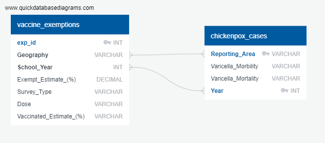

# Project 2 - Chicken Pox Vaccinations

## Background
With the advent of vaccination for COVID-19, recent controversy on vaccination rates has been determined.  Based on this, we sought to look at vaccination rates of previous well established communicable diseases (e.g. varicella) as well as exemptions and mortality.  With the recent popularity in anti-vaccine movements, we propose there will be an increase in exemptions and increase in number of cases and deaths.

## Datasets
We sought to find the morbidity and mortality of Varicella (Chickenpox) reported by the CDC from 2016-2019.

**Yearly Mortality and Morbidity HTML Tables**

https://wonder.cdc.gov/nndss/static/2016/annual/2016-table2o.html

https://wonder.cdc.gov/nndss/static/2017/annual/2017-table2o.html

https://wonder.cdc.gov/nndss/static/2018/annual/2018-table2o.html

https://wonder.cdc.gov/nndss/static/2019/annual/2019-table2r.html

Abbrevations:
N - Not reportable

NReq - Not required

In addition, we identified vaccination coverage and exemptions among kindergartners (2016-2019):
https://data.cdc.gov/Vaccinations/Vaccination-Coverage-and-Exemptions-among-Kinderga/ijqb-a7ye/data

**Extract and Transform | Types of Data Wrangling Performed** (main_final.ipynb)

**Morbidity and Mortality Data**
  1. To obtain the morbidity and mortality data, we used webscraping to download data for the morbidity and mortality of Varicella each year (2016-2019) using beautiful soup.
     There are (4) datatables, each with a unique URL. 
  2.  Once extracted, the tables were imported into Pandas and Jupyter Notebook.  
  3. We then dropped other disease reported (e.g. Typhoid Fever), dropped all NULL / NaN values and dropped unncessary columns.  
  4. All 4 years were then combined and exported into a CSV (chix_cases.csv).

**Vaccine Exemption Data**
  1. For the vaccine exemption, we downloaded the CSV and imported this to Pandas and Jupyter Notebook.  
  2. We filtered for Varicella and Exemption and removed "randomed survey" on basis of reporting.  
  3. We then filtered from 2016-2019 by look at the beginning of the reported school year given the downloaded data.  
  4. We then exported this into a CSV (vaccine_exemption.csv)

**Load | Database and ERD** (project2sql)

  1. After CSV export, we created two tables in SQL mirroring the CSV files
  2. We then imported the CSV files into SQL.  
  3. We performed innerjoin on year and geography
  4. Final table was exported.
